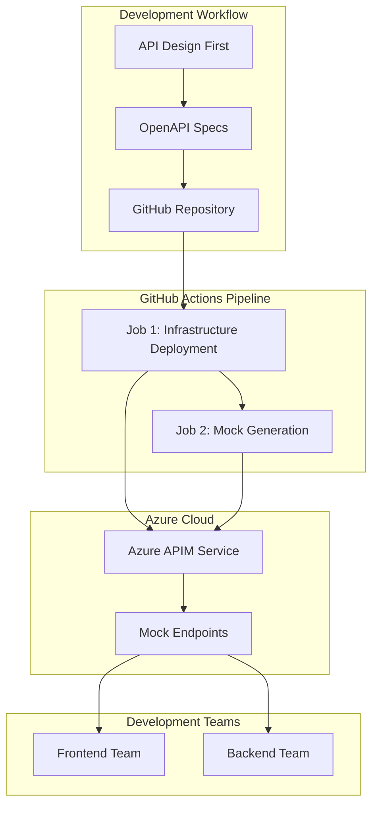

```mermaid
graph TB
    subgraph "Development Workflow"
        A[API Design First] --> B[OpenAPI Specs]
        B --> C[GitHub Repository]
    end
    
    subgraph "GitHub Actions Pipeline"
        C --> D[Job 1: Infrastructure Deployment]
        D --> E[Job 2: Mock Generation]
    end
    
    subgraph "Azure Cloud"
        D --> F[Azure APIM Service]
        E --> F
        F --> G[Mock Endpoints]
    end
    
    subgraph "Development Teams"
        G --> H[Frontend Team]
        G --> I[Backend Team]
    end
```