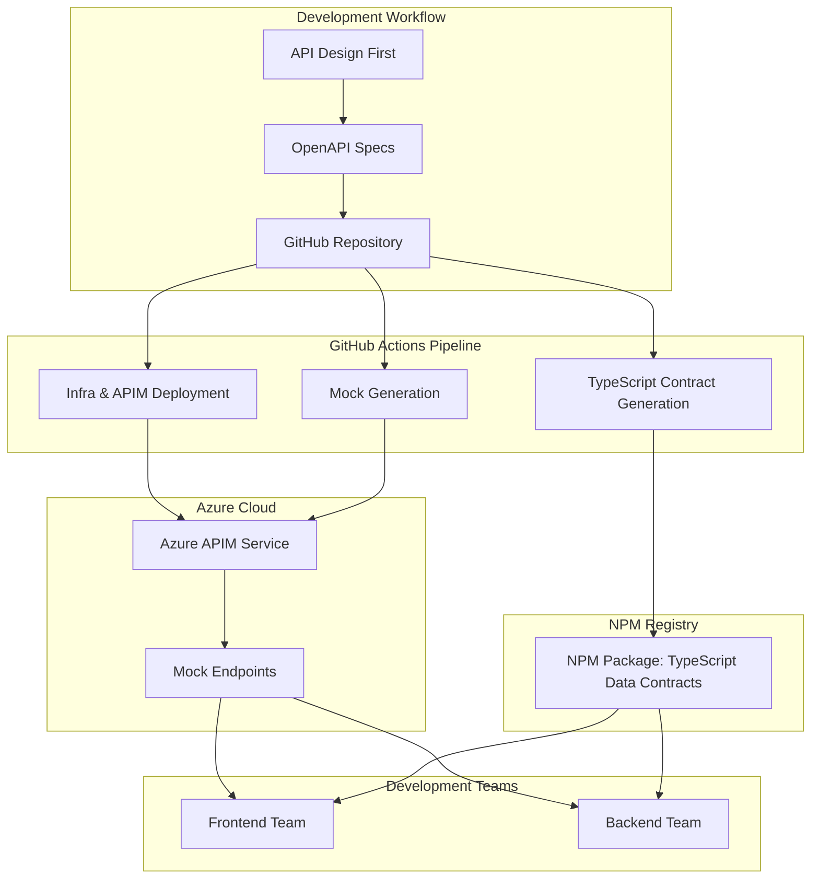

```mermaid
graph TB
    subgraph "Development Workflow"
        A[API Design First] --> B[OpenAPI Specs]
        B --> C[GitHub Repository]
    end
    
    subgraph "GitHub Actions Pipeline"
        C --> D[Infra & APIM Deployment]
        C --> E[Mock Generation]
        C --> F[TypeScript Contract Generation]
    end
    
    subgraph "Azure Cloud"
        D --> G[Azure APIM Service]
        E --> G
        G --> H[Mock Endpoints]
    end
    
    subgraph "NPM Registry"
        F --> I[NPM Package: TypeScript Data Contracts]
    end
    
    subgraph "Development Teams"
        H --> J[Frontend Team]
        H --> K[Backend Team]
        I --> J
        I --> K
    end
```