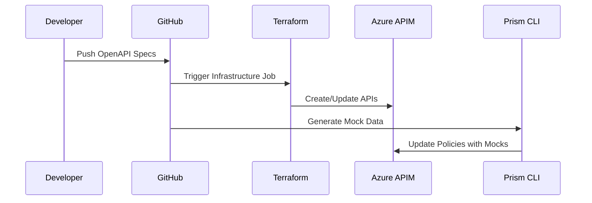

```mermaid
sequenceDiagram
    participant Dev as Developer
    participant GH as GitHub
    participant TF as Terraform
    participant APIM as Azure APIM
    participant Prism as Prism CLI

    Dev->>GH: Push OpenAPI Specs
    GH->>TF: Trigger Infrastructure Job
    TF->>APIM: Create/Update APIs
    GH->>Prism: Generate Mock Data
    Prism->>APIM: Update Policies with Mocks
```