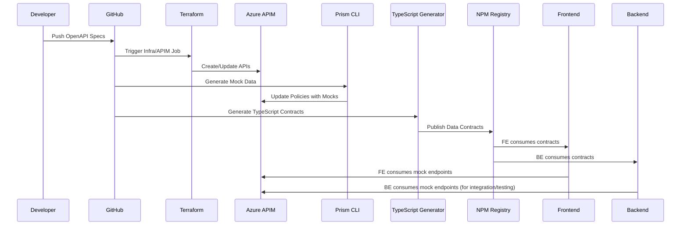

```mermaid
sequenceDiagram
    participant Dev as Developer
    participant GH as GitHub
    participant TF as Terraform
    participant APIM as Azure APIM
    participant Prism as Prism CLI
    participant Types as TypeScript Generator
    participant NPM as NPM Registry
    participant FE as Frontend
    participant BE as Backend

    Dev->>GH: Push OpenAPI Specs
    GH->>TF: Trigger Infra/APIM Job
    TF->>APIM: Create/Update APIs
    GH->>Prism: Generate Mock Data
    Prism->>APIM: Update Policies with Mocks
    GH->>Types: Generate TypeScript Contracts
    Types->>NPM: Publish Data Contracts
    NPM->>FE: FE consumes contracts
    NPM->>BE: BE consumes contracts
    FE->>APIM: FE consumes mock endpoints
    BE->>APIM: BE consumes mock endpoints (for integration/testing)
```