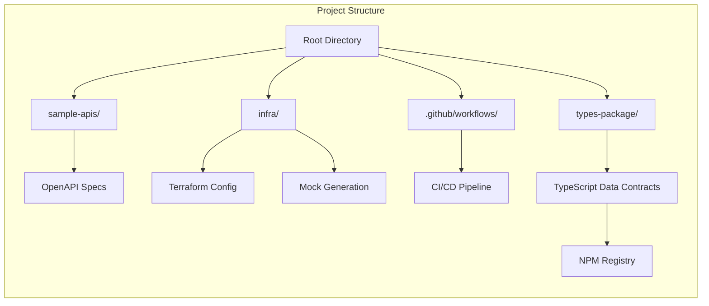

```mermaid
graph LR
    subgraph "Project Structure"
        A[Root Directory]
        B[sample-apis/]
        C[infra/]
        D[.github/workflows/]
        E[types-package/]
        F[NPM Registry]
        
        A --> B
        A --> C
        A --> D
        A --> E
        
        B --> G[OpenAPI Specs]
        C --> H[Terraform Config]
        C --> I[Mock Generation]
        D --> J[CI/CD Pipeline]
        E --> K[TypeScript Data Contracts]
        K --> F
    end
```