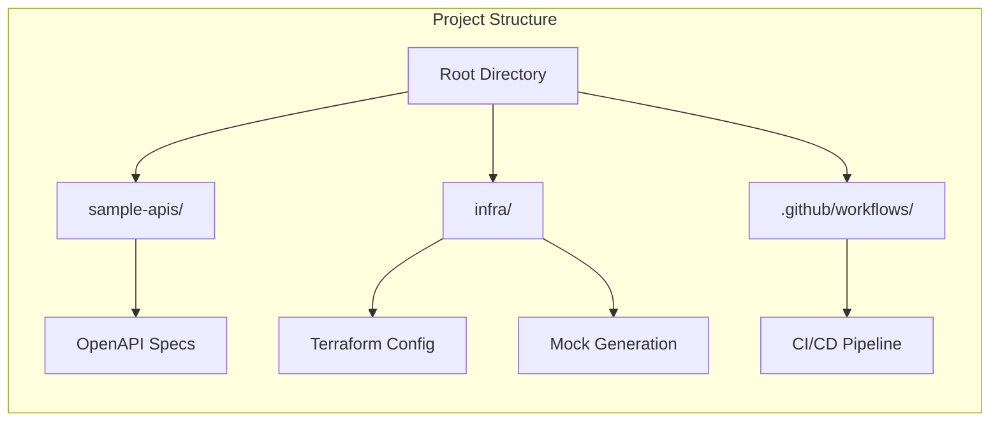

```mermaid
graph LR
    subgraph "Project Structure"
        A[Root Directory]
        B[sample-apis/]
        C[infra/]
        D[.github/workflows/]
        
        A --> B
        A --> C
        A --> D
        
        B --> E[OpenAPI Specs]
        C --> F[Terraform Config]
        C --> G[Mock Generation]
        D --> H[CI/CD Pipeline]
    end
```