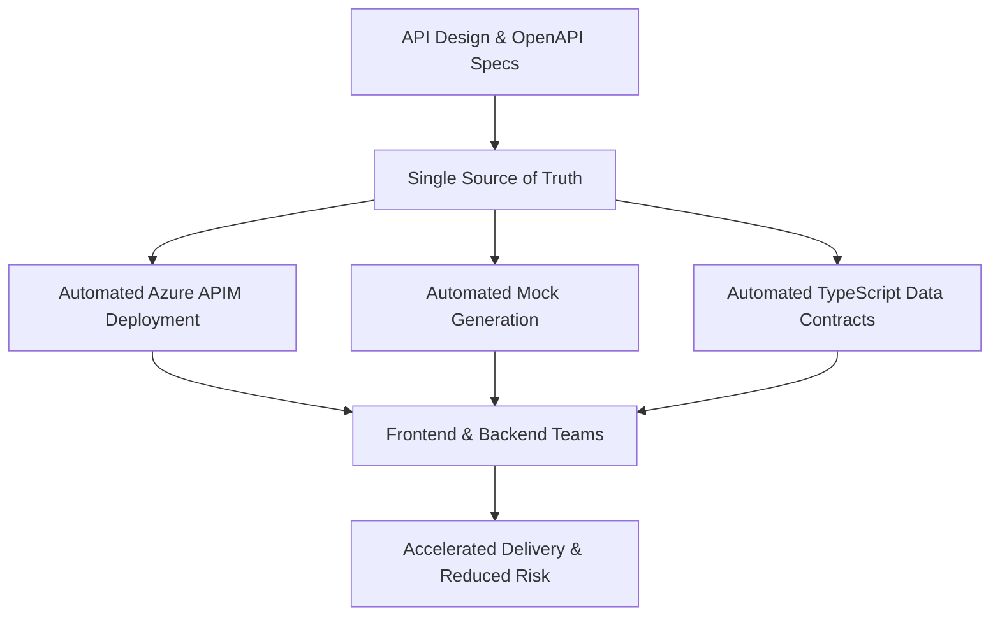

---

**Leadership Summary:**
- API specs drive all automation and contracts
- Mocks and data contracts are always up-to-date
- Frontend and backend teams move faster, with less risk and fewer integration issues
- Platform ensures a single source of truth for all API-driven development
Available now internally
Ideal for new APIs or refactors
Let’s scale this together Contact: [ghulam.ul.hassan.ali@accenture.com]