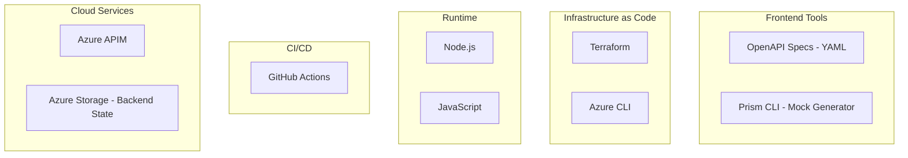

```mermaid
graph TB
    subgraph "Frontend Tools"
        A[OpenAPI Specs - YAML]
        B[Prism CLI - Mock Generator]
    end
    
    subgraph "Infrastructure as Code"
        C[Terraform]
        D[Azure CLI]
    end
    
    subgraph "Runtime"
        E[Node.js]
        F[JavaScript]
    end
    
    subgraph "CI/CD"
        G[GitHub Actions]
    end
    
    subgraph "Cloud Services"
        H[Azure APIM]
        I[Azure Storage - Backend State]
    end
```